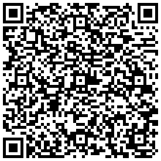

```{r setup, include=FALSE}
library(knitr)
library(printr)
library(tidyverse)
knitr::opts_chunk$set(echo = TRUE, error=TRUE
                     , class.error='error'
                     , class.warning='warning'
                     , class.message='message'
                     , cache=TRUE)
options( repos="https://cran.rstudio.org"
       , width=60
       )
```

-----

 [CC BY-SA 3.0](http://creativecommons.org/licenses/by-sa/3.0/)](images/welcome50.jpg){.fullpage}

## Who am I

### Academic

* Assistant Professor in Division of Epidemiology
* Research Associate at SLC Veterans Health Administration.
* Approximately 15 years working in R
* [https://github.com/halpo]
* Author of 12 packages on CRAN.
* [ORCID: 0000-0002-6149-2438](https://orcid.org/0000-0002-6149-2438/print)
* [NIH Bibliography](https://www.ncbi.nlm.nih.gov/myncbi/andrew.redd.2/bibliography/public/)

### Contact Info

* Andrew.Redd@hsc.utah.edu
* Office 1st floor, Room 1N411

<div class="notes">
But just ask because no one knows room numbers down there.
</div>


# Overview

## What you should know already

> * Basic computing
>   + Your operating system
>   + Internet search
>   + Et cetera
> * At least one statistical analysis software system
>   + SAS
>   + STATA
>   + *Excel does not cut it*
> * Basics of statistical analysis
>   + p-values
>   + hypothesis tests
>   + linear regression

## What should already be done

> - Installed [R](https://cran.r-project.org)
> - Installed [RStudio](https://rstudio.org)
> - Join [Microsoft Teams team](https://teams.microsoft.com/l/team/19%3aZXNSxAKzU66xF3Ao5-IQ-SO7_DOVqHh4ltU0ilm0-HI1%40thread.tacv2/conversations?groupId=92083ec4-b4ed-4248-b9ea-20ed8ba9fcd9&tenantId=5217e0e7-539d-4563-b1bf-7c6dcf074f91)  


## Goals for this class

1. Learn where to find help.
2. Learn the principles to effectively using R.
3. Learn basic procedures in R
    a. Data cleaning
    b. Table construction
    c. Analyses: t-test, linear models, etc.
