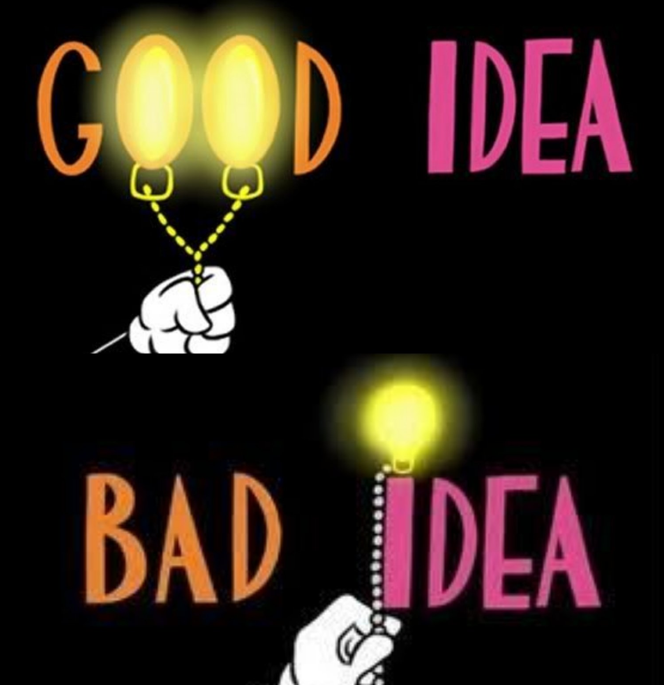

-----

~~This will be short, I promise.~~

Year's past feedback said this needed to be much longer.


# The absolute most important part of syntax ... Comments{.build}

## Comments

Comments are started by the `#` character and continue to the end of the line.

```{r Comments}
# Comments use the '#' character

1 + 1 # But they don't have to be the whole line

```

*There is no multi-line comment in R*

## Special Comments

Some comments have special meaning.

>    - `#'` Roxygen documenting comment
>    - `#!` sometimes configuration comments
>    - `#<` hey I'm talking about this comment.

-----


{.fullpage}

# What's in a name ... Variables

## Assignments

* `a <- 1` assigns the value `1` to the variable `a`.
* `a = 1` does the same, *generally*.
    + The "generally" is why this is also generally discouraged.

## Variables {.build}

Variables "can" include:

>   - **letters** (case-sensitive)
>   - **numbers**
>       + as long as it does not start with a number
>   - period
>       + if it starts with a period it is 'hidden'
>   - underscore, but may not start with underscore
 
## Getting fancy

* But if you want to be fancy use back ticks `\`` and you can do whatever you want.

```{r "Long name assignments"}
`A variable name that is actually informative` <- 
    "A string that is not"
`A variable name that is actually informative`
```
## {.flexbox .vcenter}

{.fullpage}

## Good Name, Bad name

:::::: {.columns}
::: {.column}
**Good Name**

* `TIU.document.data`
* `fit_model`
* `\`base model without longitudinal variables\``


:::
::: {.column}
**Bad Name**

* `x`
* `y`
* `lm`
* `summary`
:::
::::::

# Functions

## Functions {.build}

Functions provide reusable functionality.

#### Examples:

* `print()`
* `c()`, short for combine 
* `cat()`, concatenate
* `lm()`, linear model
* `plot()`, plot data


## Calling functions {.build}

Call a function with the function name followed by parentheses.

```{r}
print("Hello Bootcamp")
```

### Aside: Printing
The `print` function is often not called explicitly but rather implicitly.
If a value is stored in a variable calling just that variable will print the value out.
```{r}
hb <- "Hello Bootcamp"
hb
```


## Arguments {.build}

In `print("Hello Bootcamp")` the `"Hello Bootcamp"` is an argument.

### Named
Arguments can be named such as in

```r
plot(data=iris, x=Sepal.Length, y=Petal.Length)
```

Use the `=` to specify the name of any argument

### Unnamed

Or they can be unnamed as in the previous example.

## Arguments

### Mixed

**You can mix named and unnamed**

```{r}
cat("Hello", "Bootcamp", sep=" ")
```

## Creating Functions

Create a function with with the `function` keyword followed by parentheses for the arguments.

```{r "Hello world function creation"}
hello_world <- function(who = 'world', how = 'hello'){
    print(paste(how, who))
}
```

## Variadic Arguments {.build}

Often functions use the special argument `...`, which is a placeholder
for as many arguments as you wish.

### Example

```{r}
print
```
Print takes arguments `x` and `...` which is used for parameters to affect printing.

*`print()` is also an example of a method which we will discuss later.*

## Operators {.build}

:::::: {.columns}
:::{.column style="width: unset;"}
**Unary**

* `-`, `+`
* `!` logical not,
* `?` help,
* `??` help search,
* `~` formula,
:::
:::{.column style="width: unset;"}

**Math**

+ `+`, `-` add/subtract,
+ `*`, `/` multiply/divide,
+ `^`, `**` exponents,
+ `%%` modulus,
+ `%/%` integer division,
:::
:::{.column style="width: unset;"}
**Matrix**

+ `:` sequence,
+ `%*%` matrix product,
+ `%o%` outer product,
+ `%x%` Kronecker product,

**Logical**

+ `<`, `>`, `==`, `<=`, `>=`, `!=`
+ `&`/`|` vectorized 'and'/'or',
+ `&&`/`||` singular 'and'/'or',
:::
::::::

## Precedence 

1. `::`,
2. `$`, `@`
3. `^`
4. `-x`, `+x` Unary minus/plus
5. `:`
6. All `%%`operators
7, `*`, `/`	
8. `+`, `–`
9. `<`, `>`, `<=`, `>=`, `==`, `!=`
10. `!`, `&`, `&&`, `|`, `||`
11. `~`
12. `->`, `->>`, `<-`, `<<-`, `=`


# Types

## Vectors {.build}

* In R everything is a vector
* Sequential vectors can be created with `:`
```{r "sequence operator"}
a <- 1:5
```
* Create longer vectors by combining smaller vectors
```{r "Combine operator"}
b <- c(a, 6, 7, 8)
```

## Class {.build}

An object's class given information about what the class is supposed to be or do.

The `class()` function gives the object class.

::::::{.columns-2}
:::{.column}
```{r}
class(1:2)
class(pi)
class('Hello Bootcamp')
```
:::
:::{.column}
```{r}
class(print)
class(iris)
```
:::
::::::


## Basic Types, i.e. Mode 

::::::{.columns-2}
:::{.column}
* integer
* numeric
* logical
* character
* list (i.e. anything)
* *language*
:::
:::{.column}
```{r}
mode(pi)
mode(iris)
mode(print)
```
:::
::::::

## Vector Operations {.build}

most operations expect and operate on vectors.

```{r}
a <- 1:5
a^2
```

When given a vector that doesn't match the length of the other  elements are repeated.  
```{r}
a <- 1:5
a^(1:2)
```

If the larger is not a multiple of the shorter a warning will be given.

## Indexing (2-types)  {.build}

:::::: {.columns-2}
::: {.column}
* `[` - subsetting
  - preserves class
  - multiple indices
:::
::: {.column}
* `[[` - extraction
  - no guarantee of class
  - single index
:::
::::::

```{r Lists}
# A list holds anything
a <- list(first=1L, second=2, FALSE)
```

:::::: {.columns-2}
::: {.column}
```{r "single bracket indexing"}
# by position
class(a[1])
# by name
class(a['second'])
```
:::
::: {.column}
```{r "Double bracket indexing"}
# by position
class(a[[1]])
# by name
class(a[['second']])
```
:::
::::::

## `$` Indexing

lists may also be indexed by the `$` sign.

*But be careful not all vectors can be.*

```{r "Dollar indexing"}
a$first
a$second
```

This comes in useful for data.

## Data Types

### Data for our purpose is:
> * A (named) list of variables,
>   - where all variables have the same length;
> * Rectangular with  and rows as observations.
>   - columns as variables `ncol(iris)=``r ncol(iris)`
>   - and rows as observations `nrow(iris)=``r nrow(iris)`

## Example Data: Iris

```{r}
iris
```

## Creating Data {.build}

```{r}
data.frame(
    x = 1:100,
    y = rnorm(100) #< random normals
)
```

We will discuss tibbles in the Tidyverse slides.


# SPECIAL

## The Pipe `%>%`

The pipe is a newer but very handy tool in R.

Use it to tie multiple short statements together into a single 
complex statement that is easy to understand and use. 
It comes from the `magrittr` package but it is more common to use it through the tidyverse package, which will be covered in detail later.
```{r "Pipe operator"}
library(tidyverse)
iris %>% #< take iris data
    filter(Species=='setosa') %>% #< perform a filter
    nrow() #< count the rows.
```

## Next Up {.flexbox .vcenter}

**[Packages](04-Packages.html)**
