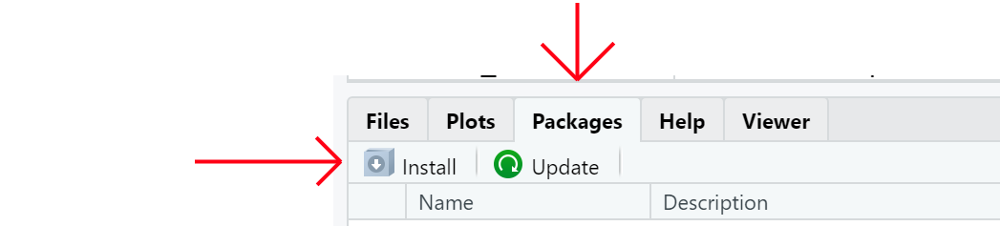

```{r setup, include=FALSE}
library(knitr)
library(printr)
library(tidyverse)
knitr::opts_chunk$set(echo = TRUE, error=TRUE
                     , class.error='error'
                     , class.warning='warning'
                     , class.message='message'
                     , cache=TRUE)
options( repos="https://cran.rstudio.org"
       , width=60
       )
```


# Packages


## Packages

Packages hold functions and other objects grouped according to theme or purpose
described by the DESCRIPTION file.

Examples:

* [boot](https://cran.r-project.org/package=boot) - Bootstrap Functions
* [gam](https://cran.r-project.org/package=gam) - Generalized Additive Models
* [forcats](https://cran.r-project.org/package=forcats) - Tools for Working with Categorical Variables (Factors)


## Loading Packages

To load packages in R use `library` or `require`
```{r}
library(tidyverse)
require(magrittr)
```

## Package Information 

* `packageDescription('stats')`
```{r, echo=FALSE}
packageDescription('stats')
```

## Package Information 

* `packageDescription('stats')` for DESCRIPTION information.
* `help(package='stats')` for index page, or 
* `package?stats`
```
		Information on package ‘stats’

Description:

Package:            stats
Version:            3.6.3
Priority:           base
Title:              The R Stats Package
Author:             R Core Team and contributors worldwide
Maintainer:         R Core Team <R-core@r-project.org>
Description:        R statistical functions.
License:            Part of R 3.6.3
Imports:            utils, grDevices, graphics
Suggests:           MASS, Matrix, SuppDists, methods, stats4
NeedsCompilation:   yes
Built:              R 3.6.3; x86_64-w64-mingw32; 2020-02-29 09:37:04 UTC;
                    windows
```

## Package Information 

* `packageDescription('stats')` for DESCRIPTION information.
* `help(package='stats')` for index page, or 
* `package?stats` for the package help page.
```
stats-package              package:stats               R Documentation

The R Stats Package

Description:

     R statistical functions

Details:

     This package contains functions for statistical calculations and
     random number generation.

     For a complete list of functions, use ‘library(help = "stats")’.

Author(s):
     R Core Team and contributors worldwide
     Maintainer: R Core Team <email: R-core@r-project.org>
```

## Namespaces

Packages encapsulate functions and objects together in a Namespace.
A namespace is comprised of three layers.

> 1. **Imports**
>     * Functions available inside the package from other packages.
> 2. **Private** 
>     * Internal functions, those defined inside the package 
>       but only available to other functions in the namespace
> 3. **Exports**
>     * Public interface functions.

## Naming Conflicts

* Namespaces also manage naming conflicts.
* *Example:* `collapse()` function definitions exists in:
    + [`dplyr`](https://www.rdocumentation.org/packages/dplyr/versions/0.7.8/topics/compute)
    + [`ggtree`](https://www.rdocumentation.org/packages/ggtree/versions/1.4.11/topics/collapse)
    + [`nlme`](https://www.rdocumentation.org/packages/nlme/versions/3.1-148/topics/collapse)
    + [`pkgcond`](https://www.rdocumentation.org/packages/pkgcond/versions/0.1.0/topics/collapse)
    + [...](https://www.rdocumentation.org/search?q=collapse)

## Search Path
To see what is loaded use `search()`

```{r}
search()
```

## Namespace Specifier

To use a function from a specific package use the `::` operator.  
It may also be used to call a function from a package with loading the package to the search path.

```{r}
dplyr::last(.leap.seconds)
```

### BONUS: Triple Colon

The `:::` operator breaks encapsulation and retrieves the internal objects of a package, but you will have to know what you are looking for and these functions are rarely documented.


# Finding Packages


## Repositories

Repositories are locations where you (and R) can find packages to install and use.

* Structured/Organized
* Typically Online, but can be private.
* Two Major:
    * CRAN
    * BioConductor

## CRAN

[CRAN](https://cran.r-project.org/) stands for: Comprehensive R Archive Network

+ The main (and official) repository for contributed R Packages. 
+ There are currently `r nrow(utils::available.packages())` packages available on CRAN.
+ Low bar to get in.
+ Anyone can contribute.

## CRAN:Installing

Most packages will be installed by `install.packages()` function:

```r
# Tools for regression and classification models
install.packages('caret')
```

Most will find it easier to install through RStudio




## BioConductor
[BioConductor](http://www.bioconductor.org/)

+ Additional Repository specializing in high throughput genomic data packages.
+ Much more rigorous to gain entry to. 

## BioConductor - Installing

### Prior to R < 4.0.0
```r
source("https://bioconductor.org/biocLite.R")
biocLite()
biocLite("Rgraphviz")
```

### R >= 4.0.0
```r
if (!requireNamespace("BiocManager", quietly = TRUE))
    install.packages("BiocManager")
BiocManager::install(version = "3.11")
BiocManager::install("Rgraphviz")
```

## Github

*Not technicaly a repository* 

+ Where most new R work in completed.
+ Ties in with many other services for things like 
    - testing
    - documentation
    - deployment
    
## Github - installing

For latest development, i.e. pre-release code use the
[`devtools`](https://cran.r-project.org/package=devtools) package.

```r
install.packages("devtools")
devtools::install('halpo/pivot')
```

## Managing Packages

* `installed.packages()`
* `remove.package()` &leftarrow; I don't think I have *ever* done this.
* `old.packages()`
* `update.packages()`

**Of course all this can be acomplished through RStudio a bit easier.**

## Next Up {.flexbox .vcenter}

**[Tidyverse](04-Packages.html)**
