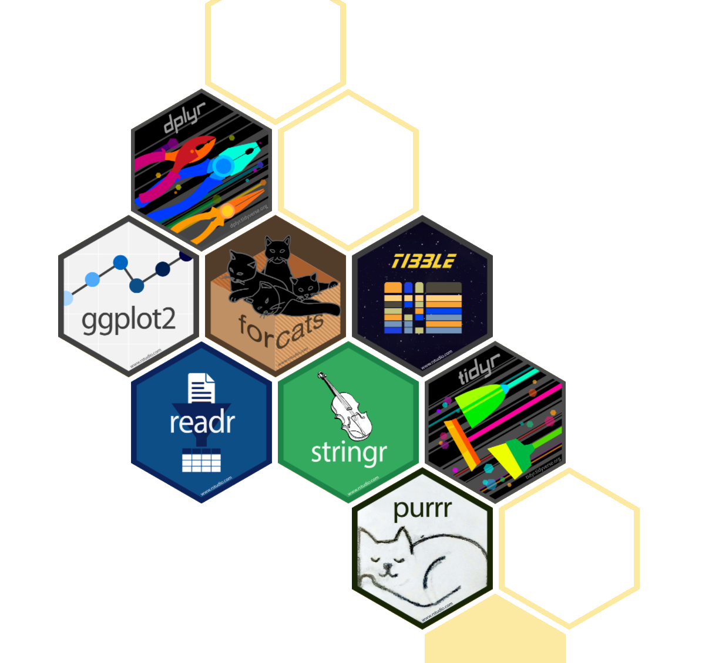

```{r setup, include=FALSE}
library(tidyverse)
```

# Tidyverse
```{css, echo=FALSE}
.fullright {
    height: -webkit-fill-available;
    float: right;
}

```
{.fullright}


## Tidyverse - R For Data Science

{.float-right}

* The Tidyverse is [R for Data Science](https://r4ds.had.co.nz/)
    + The [book](https://r4ds.had.co.nz/) is well worth your time to read.

## Tidyverse - Packages

* Cohesive set of packages to handle common aspects of data analysis.
    + Import data
        - [readr](https://readr.tidyverse.org/) - flat data files (csv, tsv, fwf)
        - [haven](https://haven.tidyverse.org/) - SAS, SPSS, Stata
        - [readxl](https://readxl.tidyverse.org/) - Excel data
        - [DBI](https://github.com/rstats-db/DBI) + [dbplyr](https://dplyr.tidyverse.org/) - Database Inferfaces
        - Web data:
          [httr](https://github.com/r-lib/httr)(API),
          [rvest](https://github.com/tidyverse/rvest)(Scraping), 
          [jsonlite](https://github.com/jeroen/jsonlite#jsonlite)(JSON), and        
          [xml2](https://github.com/r-lib/xml2)(XML)

## Tidyverse - Packages
* Cohesive set of packages to handle common aspects of data analysis.
    + Import
    + Wrangle
        - [dplyr](https://dplyr.tidyverse.org/) - grammar of data manpulation
        - [tidyr](https://tidyr.tidyverse.org/) - data shaping; wide, long, & nesting
        - [stringr](https://stringr.tidyverse.org/) & [stringi](https://github.com/gagolews/stringi) - String manipulation
        - [forcats](https://forcats.tidyverse.org/) - Categorical manipulation; labeling, combining categories, etcetera.
        - [lubridate](https://lubridate.tidyverse.org/) & [hms](https://github.com/tidyverse/hms) - Date & time
        - [broom](https://broom.tidymodels.org/) - Making untidy R objects tidy.

## Tidyverse - Packages

* Cohesive set of packages to handle common aspects of data analysis.
    + Import
    + Wrangle
    + Abstraction
        - [tibble](https://tibble.tidyverse.org/) - Table *like* objects with a common inferface.
        - [dbplyr](https://dplyr.tidyverse.org/) - database operation abstraction.
        - [purrr](https://purrr.tidyverse.org/) - Functional programming, map & reduce.
    
## Tidyverse - Packages

* Cohesive set of packages to handle common aspects of data analysis.
    + Import
    + Wrangle
    + Abstraction
    + Visualization
        - [ggplot2](https://ggplot2.tidyverse.org/) - 
          Data visualization & graphics abstraction through the grammar of graphics.
    
## Tidyverse - Packages

* Cohesive set of packages to handle common aspects of data analysis.
    + Import
    + Wrangle
    + Abstraction
    + Visualization
    + Programming
        - [magrittr](https://magrittr.tidyverse.org/) - Pipes to simplify programming.
        - [glue](https://github.com/tidyverse/glue) - Strings + data
        - [rlang](https://rlang.r-lib.org/) - manipulation of R language base types.
    
## The Pipe `%>%`

Use it to tie multiple short statements together into a single 
complex statement that is easy to understand and use. 

```{r "Pipe operator"}
library(tidyverse)
iris %>% #< take iris data
    filter(Species=='setosa') %>% #< perform a filter
    nrow() #< count the rows.
```

    
## Tidyverse - Packages

* Cohesive set of packages to handle common aspects of data analysis.
    + Import
    + Wrangle
    + Abstraction
    + Visualization
    + Programming
    + Modeling
        - [tidymodels](https://www.tidymodels.org/) - A whole separate set of packages.

## The Tidy Manifesto

There are four basic principles to a tidy API:

* Reuse existing data structures.
* Compose simple functions with the pipe.
* Embrace functional programming.
* Design for humans.

<https://tidyverse.tidyverse.org/articles/manifesto.html>

## Principle: Reuse existing data structures

* Use existing/common data structures
* Data are table-like and rectangular
    * observations are rows
    * variables are columns

*This is all encapsulated with the tibble*

## The `tibble`

* Abstraction of rectangular data
* Nice labels
* Local & Remote data
* Prints nicely

```{r}
tibble(x = 1:4, y = rnorm(4))
```


## Principle: Compose simple functions with the pipe.

* Strive to keep functions as simple as possible (but no simpler!).
* Functions do one thing and one thing only.
* Either modify or side-effects but never both.
* Naming:
    + 
    + Functions are **verbs**

## Principle: Embrace functional programming.

* Immutable objects
* Dependant only on inputs.  Avoid "state" variables.
* Generic functions over object methods
* Abstract over for-loops & map operations.


## Principle: Design for humans.

- Easy to use names, easy to remember & consistent.
- Favor longer names that are descriptive, informative, and accurate.
- save the shortest names for the most important and often used.
- Think about auto-complete, use common prefix rather than suffix.

## Tidyverse is evolving

* RStudio supports the Tidyverse.
* Development is ongoing.
* Check their [blog](https://www.tidyverse.org/blog/) for the newest developments.

        
