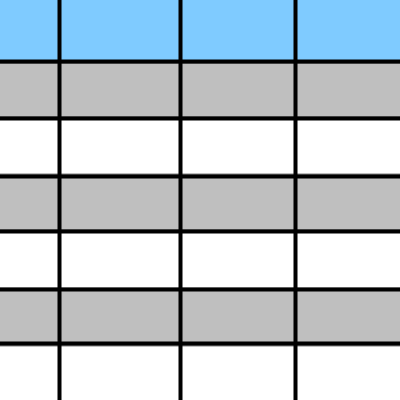

```{r setup, include=FALSE}
library(knitr)
library(printr)
library(tidyverse)
knitr::opts_chunk$set(echo = TRUE, error=TRUE
                     , class.error='error'
                     , class.warning='warning'
                     , class.message='message'
                     , cache=FALSE)
options( repos="https://cran.rstudio.org"
       , width=60
       )
```

# Getting Data



## Local Data {.build}

Data in R is held locally (i.e. in memory).

Most functions for reading data are simple and obviously named.

-   read.csv

    -   reads in a comma separated file.

-   read.fwf

    -   reads fixed width format.
## COVID Data

The first data set we will use was compiled by the John's Hopkins Coronavirus Resource Center and can be obtained from <https://data.humdata.org/dataset/novel-coronavirus-2019-ncov-cases> or [kaggle](https://www.kaggle.com/baguspurnama/covid-confirmed-global). It gives worldwide data for the COVID-19 pandemic from January 2020 through mid July 2021.

The data is split into three files;

-   `confirmed.csv` for confirmed cases,
-   `deaths.csv` for deaths attributed to COVID-19,
-   and `recovered.csv` for those who have recovered.

## Read in the data

```{r "reading in the data"}
confirmed.data.raw.base <- read.csv("data/confirmed.csv")
head(confirmed.data.raw.base)
```

## Tidy solution: `readr`

```{r "reading in data with readr", df_print="DT"}
confirmed.data.raw.tidy <- readr::read_csv("data/confirmed.csv")
```


## Tidy output

```{r}
head(confirmed.data.raw.tidy)
```


## Task {.flexbox .vcenter}

Find a function that reads in Microsoft Excel 'xlsx' files. Refer back to the [Resources slides](Resources.html) if you need.

::: {#timer1 .timer onclick="startTimer()"}
2:00
:::

## Possible Answers

-   [`readxl::read_excel()`](https://www.rdocumentation.org/packages/readxl/versions/1.3.1/topics/read_excel)
-   [`officer::read_excel()`](https://www.rdocumentation.org/packages/officer/versions/0.3.5/topics/read_xlsx)
-   [`openxlsx::read.xlsx()`](https://www.rdocumentation.org/packages/openxlsx/versions/4.1.0.1/topics/read.xlsx)
-   [`xlsx::read.xlsx()`](https://www.rdocumentation.org/packages/xlsx/versions/0.6.1/topics/read.xlsx)

## Excel solution

```{r "reading in the excel data"}
confirmed.data.raw.xl <- readxl::read_excel("data/confirmed.xlsx")
head(confirmed.data.raw.xl)
```

## Examining data

Useful tools for examining data.

-   `str()` - 'structure' of the data.
-   `glimpse()` - more useful version of str and works on all tibbles.
-   `head()` - first n rows.
-   `tail()` - last n rows
-   `summary()` - will give univariate summaries of variables.

## `glimpse()`

```{r}
glimpse(confirmed.data.raw.tidy)
```

## Problem {.flexbox .vcenter .build}

This is only one set 🙁


## Purrr to the rescue

```{r "Read ALL the data", message=FALSE}
library(readr)
library(purrr)
(data.files <- list.files("data", pattern=".*[.]csv", full.names=TRUE))
covid.data.wide.raw <- map(data.files, read_csv)
```

::: {.smaller}
*column specification messages suppressed for this slide*
:::

## Mapping {.build}

### Map Definition

Apply a function to each element of a list or vector and return the results.

### Example
```r
map(data.files, read_csv)
```

Call the function `read_csv()` for each element of `data.files`, or which there are three; `confirmed.csv`, `deaths.csv` and `recovered.csv`.

We expect a list of three elements, each a `tibble` or `data.frame` with 449 columns.

## Checks

```{r}
length(covid.data.wide.raw)
map(covid.data.wide.raw, class)
map(covid.data.wide.raw, dim)
```


## Map Variants by output

::: {.columns-2}
::: {.column}
-   `map()` = list,
-   `map_lgl()` = logical
-   `map_int()` = integers
-   `map_dbl()` = numbers
:::

::: {.column}
-   `map_chr()` = strings
-   `map_dfc()` = column bound data
-   `map_dfr()` = row bound data
:::
:::

## Other `*map*` variants

- `map2()` & `map2_*()` = take two lists or vectors of the same length and call the given function for each pair of inputs.
- `imap()` & `imap_*()` = index map, functions must accept the element and the index or name of the element.  Equivalent to `map2(x, names(x), fun)` or `map2(x, seq_along(x), fun)`
- `pmap()` & `pmap_*()` generalization of map 2 to arbitrary number where the vectors must be provided as a list.
- `map_if()` apply only to elements matching a given predicate, leave others alone.
- `map_at()` apply only at specified indices, leave others alone.


## Quiz {.flexbox .vcenter .build}

What form is the data in?

What form do we want it in?

### Task

Collapse it into a single data.frame

## Possible solution 1: com`bind_rows` {.build}

```{r}
covid.data.wide.raw %>% 
    bind_rows(.id="file") %>% 
    select(file, 1:10) %>% 
    glimpse()
```


## Possible solution 2: Change the mapping function {.build}

but also get the right name.

``` {r, message=FALSE}
covid.data.wide.dfr <- 
    data.files %>% 
    set_names(.,.) %>% 
    map_dfr(read_csv, .id = "file")
```

##  {.flexbox .vcenter}

Time for an aside on the pipe.

## Manipulating the pipe {.build}

```r
data.files %>% 
    set_names(.,.)
```

The dot or period `.` has special meaning in the context of the pipe; it specifies where the argument should go.

Since the dot is repeated we use the argument twice.  So the statement is equivalent to:

```r
    set_names(data.fies, data.files)
```

## Pipe functions

When the `.` starts a statement it creates a function of one argument.

```{r}
    . %>% set_names(.,.)
```

This is functionally equivalent to 

```{r}
function(x)set_names(x,x)
```

Pipe functions are one shorthand for declaring functions.

## Lambda functions

Formula based lambda function constitute the second shorthand for declaring functions, and can accept multiple arguments.

*yes, R stole this from python*

::: {.terminology}

Lambda functions

:   Functions created from formulas(`~`) with predefined arguments

    `?rlang::is_lambda`
:::

## Arguments

```{r}
rlang::as_function(~set_names(.x, .x))
```

The usable arguments are:

* `...` for variadic arguments
* `.`, `..1`, or `.x` is always the first argument
* `..2`, or `.y` is the second argument

-----

{.fullpage}


## Save it for future use

```{r "Save the data"}
save(covid.data.wide.dfr, file='data/covid.data.wide.dfr.RData')
```

OR

```{r "Save the data - rds"}
saveRDS(covid.data.wide.dfr, file='data/covid.data.wide.dfr.rds')
```

## Next Up {.flexbox .vcenter}

**[Data Wrangling](07-DataWrangling.html)**
